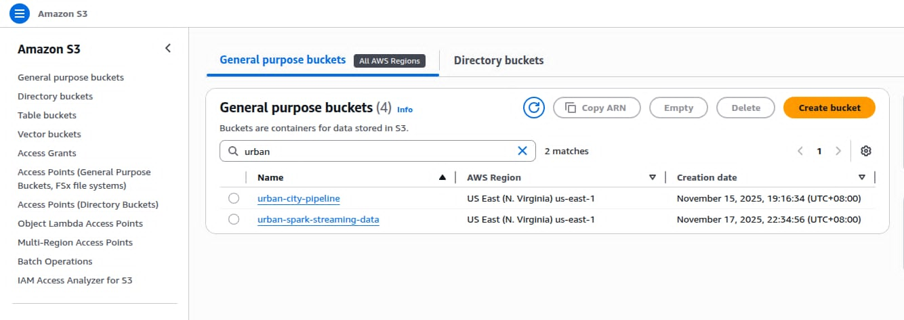
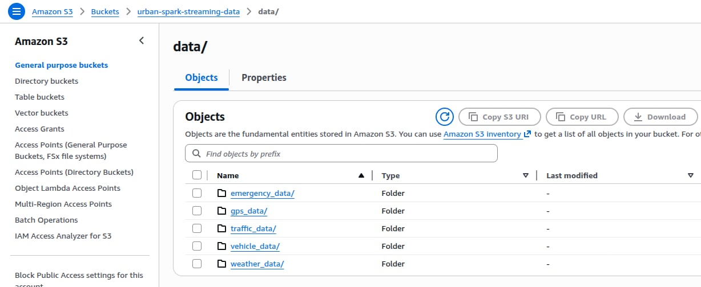
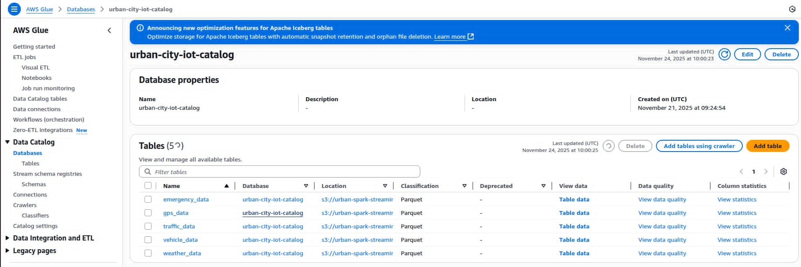
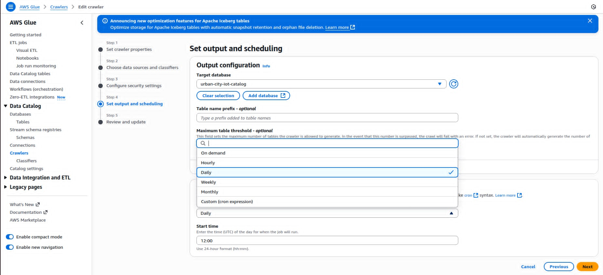
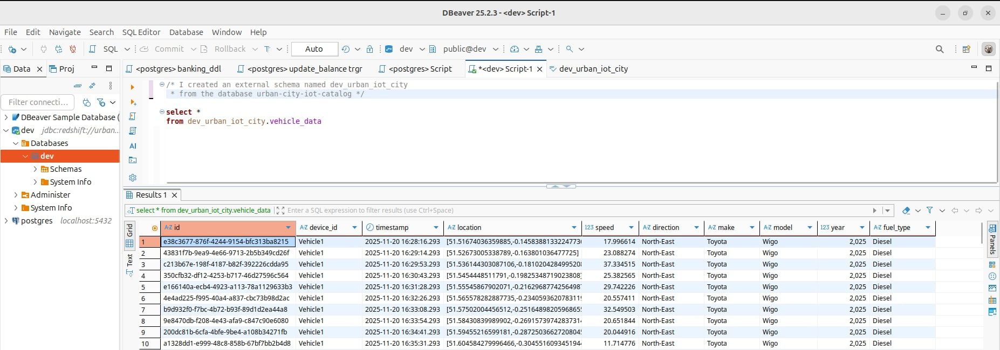
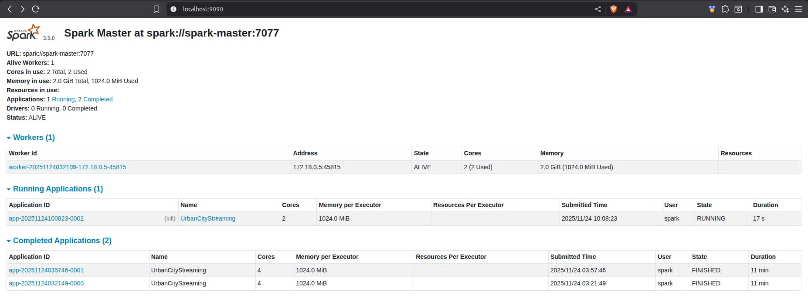
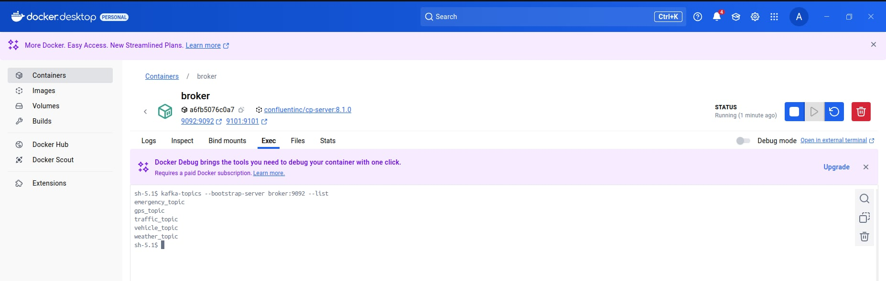

# Urban City IoT Data Pipeline

A real-time data streaming pipeline that simulates vehicle journey data from Antipolo to Baguio, Philippines. The system generates IoT sensor data (vehicle telemetry, GPS, traffic cameras, weather, and emergency incidents), processes them through Kafka and Spark, and stores the results in AWS S3 for analytics.

## Architecture Overview

```
Python Data Generator → Kafka (KRaft Mode) → Spark Streaming → AWS S3 → AWS Glue Crawler → Data Catalog
```

### Data Flow

1. **Data Generation**: Python script simulates vehicle journey with multiple IoT data streams
2. **Image Storage**: Traffic camera snapshots stored in S3 bucket (`urban-city-pipeline`)
3. **Message Broker**: Kafka topics receive real-time data streams
4. **Stream Processing**: Spark Streaming consumes, transforms, and validates data schemas
5. **Data Lake**: Processed data stored as Parquet files in S3 (`urban-spark-streaming-data`)
6. **Data Catalog**: AWS Glue Crawler catalogs data into `urban-city-iot-catalog` database

## Data Streams

The pipeline generates five concurrent data streams:

- **Vehicle Data**: Location, speed, direction, vehicle details
- **GPS Data**: Device tracking and movement metrics
- **Traffic Camera Data**: Snapshot images with location metadata
- **Weather Data**: Temperature, humidity, conditions, air quality
- **Emergency Incidents**: Accidents, roadblocks, medical emergencies

## Prerequisites

- Docker and Docker Compose
- AWS Account with S3 access
- Python 3.x
- AWS credentials configured

## Project Structure

```
.
├── docker-compose.yml
├── spark.Dockerfile
├── requirements.txt
├── .env
└── jobs/
    ├── main.py                    # Kafka producer (data generator)
    ├── street_view_utils.py       # S3 image upload utility
    └── urban-city.py              # Spark streaming consumer
```

## Configuration

Create a `.env` file in the project root:

```env
# AWS Configuration
AWS_ACCESS_KEY_ID=your_access_key
AWS_SECRET_ACCESS_KEY=your_secret_key
AWS_REGION=your_region

# S3 Buckets
BUCKET_NAME=urban-city-pipeline
SPARK_BUCKET=urban-spark-streaming-data

# Kafka Configuration
KAFKA_BOOTSTRAP_SERVERS=broker:29092
VEHICLE_TOPIC=vehicle_topic
GPS_TOPIC=gps_topic
TRAFFIC_TOPIC=traffic_topic
WEATHER_TOPIC=weather_topic
EMERGENCY_TOPIC=emergency_topic
```

## Installation

1. **Clone the repository**
   ```bash
   git clone <repository-url>
   cd urban-city-pipeline
   ```

2. **Build and start services**
   ```bash
   docker-compose up -d
   ```

3. **Verify services are running**
   ```bash
   docker-compose ps
   ```

## Usage

### Start Data Generation

```bash
python jobs/main.py
```

This simulates a vehicle journey from Antipolo to Baguio, generating data every 30-60 seconds.

### Start Spark Streaming

```bash
docker exec -it spark-master /opt/spark/bin/spark-submit \
  --master spark://spark-master:7077 \
  --packages org.apache.spark:spark-sql-kafka-0-10_2.12:3.5.3,org.apache.hadoop:hadoop-aws:3.3.4,com.amazonaws:aws-java-sdk:1.12.524 \
  /opt/spark/jobs/urban-city.py
```

### Access Spark UI

Navigate to `http://localhost:9090` to monitor Spark jobs.

## Docker Services

### Kafka Broker (KRaft Mode)
- **Ports**: 9092 (external), 29092 (internal)
- **Mode**: Combined broker and controller (KRaft - no Zookeeper)
- **Health Check**: Automated broker API version check

### Spark Master
- **Ports**: 7077 (Spark), 9090 (Web UI)
- **Resources**: Manages worker allocation

### Spark Workers (2 instances)
- **Resources**: 2 cores, 2GB memory each
- **Mode**: Worker nodes connected to master

## AWS Components

### S3 Buckets

1. **urban-city-pipeline**: Stores traffic camera snapshots
   - Images referenced via S3 URLs in streaming data
   
2. **urban-spark-streaming-data**: Contains processed Parquet files
   - `/data/vehicle_data`
   - `/data/gps_data`
   - `/data/traffic_data`
   - `/data/weather_data`
   - `/data/emergency_data`
   - `/checkpoints/` - Spark streaming checkpoints

### AWS Glue Setup

1. **Create Glue Crawler**:
   - Data source: `s3://urban-spark-streaming-data/data/`
   - Database: `urban-city-iot-catalog`
   - Schedule: On-demand or scheduled

2. **Run Crawler** to populate the data catalog

3. **Query with Dbeaver**:
   ```sql
   SELECT * FROM dev_urban_iot_city.vehicle_data LIMIT 10;
   ```

## Key Features

### Schema Enforcement
Spark validates and transforms incoming JSON data:

```python
.select(from_json(col('value'), schema).alias('data'))
```

### Watermarking
2-minute watermark handles late-arriving data:

```python
.withWatermark('timestamp', '2 minutes')
```

### Fault Tolerance
- Spark checkpointing for exactly-once processing
- Kafka offset management
- Automatic recovery from failures

## Monitoring

- **Kafka**: `docker logs broker`
- **Spark Master**: `http://localhost:9090`
- **Spark Workers**: Check logs via `docker logs spark-worker-1`
- **Producer Status**: Console output from `main.py`

## Technologies Used

- **Apache Kafka 8.1.0** (KRaft mode)
- **Apache Spark 3.5.0** (Structured Streaming)
- **AWS S3** (Data Lake storage)
- **AWS Glue** (Data cataloging)
- **Python 3.x** (Data generation)
- **Docker & Docker Compose** (Containerization)

## Deployment & Results

This project uses a hybrid deployment approach: processing infrastructure runs in Docker containers while storage and cataloging use managed AWS services.

### AWS S3 Buckets


*S3 buckets containing traffic camera images and processed streaming data*

### Processed Data in S3


*Parquet files organized by data stream type in urban-spark-streaming-data bucket*

### AWS Glue Data Catalog


*AWS Glue Data Catalog showing all 5 cataloged tables from the streaming pipeline*

### Glue Crawler Configuration


*Glue Crawler configured to automatically catalog new data*

### Dbeaver Query Results


*Sample query on vehicle data using Amazon Athena*

### Spark Streaming UI


*Spark Streaming jobs processing data in real-time*

### Kafka Topics


*Active Kafka topics receiving IoT sensor data*